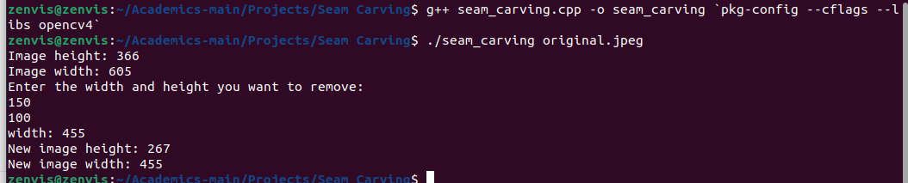
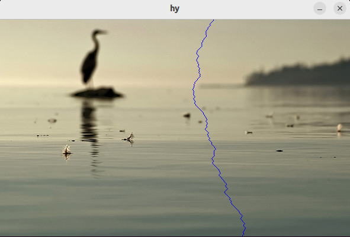
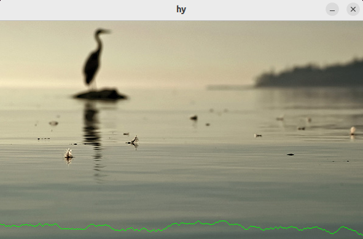
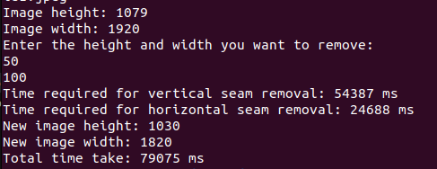
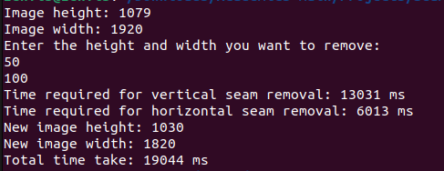

# Seam Carving Image Resizer

## Table of Contents
- [Overview](#overview)
- [Features](#features)
- [Prerequisites](#prerequisites)
- [Installation](#installation)
- [Usage](#usage)
- [How It Works](#how-it-works)
- [Technologies Used](#technologies-used)
- [Sample Images](#sample-images)
- [Limitations](#limitations)
- [Future Improvements](#future-improvements)
- [Contact](#contact)

---

## Overview

Seam Carving is an intelligent image resizing algorithm that reduces image dimensions while preserving the most important content. Unlike traditional resizing methods that crop or stretch images, this algorithm intelligently removes the least significant pixels (seams) based on their energy or in simple words, it removes the least important pixels from the image that are not contributing much to the image.

---

## Features

- **Dynamic image resizing without content distortion**
- **Vertical and horizontal seam removal**
- **Real-time visualization of seam carving process**
- **Preserves image's visual integrity**
- **Supports arbitrary image reduction**
- **Optimized for performance using parallel processing with OpenMP**

---

## Prerequisites

- OpenCV library
- C++ compiler (g++)
- Linux/Unix system recommended
- OpenMP (for parallel processing)

---

## Installation

### Dependencies

1. **Install OpenCV:**

```bash
sudo apt-get update
sudo apt-get install libopencv-dev
```

2. **Verify OpenCV installation:**

```bash
pkg-config --modversion opencv4
```

3. **Install OpenMP (if not already installed):**

```bash
sudo apt-get install libomp-dev
```

### Compile the Project

```bash
g++ seam_carving.cpp -fopenmp -o seam_carving `pkg-config --cflags --libs opencv4`
```
> Note: Replace `seam_carving.cpp` with the name of your source code.

---

## Usage

1. **Prepare input image**
2. **Run the program:**

```bash
./seam_carving /address/of/image/input_image.jpg
```

3. You will see the original image height and width in pixels.
4. Enter the desired width and height reduction that you want to remove from your image.
5. Press Enter to start the seam carving process.
6. You will see the original image getting shrinked vertically and horizontally in real-time.
7. At the end, the output image will be stored in the same folder as your source code.
8. You will see the final image width and height on the terminal.

> Note: Replace `input_image.jpg` with your image file.

---

## How It Works

The algorithm follows these key steps to reduce the size both vertically and horizontally:

1. **Calculate pixel energy matrix using dual-gradient energy function**:
   - Computes the energy of each pixel based on its surrounding pixels using the gradient of RGB values.

2. **Find lowest-energy seam path using dynamic programming**:
   - Uses dynamic programming to determine the path with the least energy (i.e., the seam that will be removed).

3. **Remove identified seam by shifting pixels**:
   - Once the seam is identified, it is removed by shifting the remaining pixels in the image.

4. **Repeat until desired image size is achieved**:
   - The process continues until the image is reduced to the desired dimensions.

### Key Algorithmic Stages

1. **RGB Extraction**:
   - Extracts RGB values from the input image for energy computation.

2. **Energy Gradient Computation**:
   - Computes the energy of each pixel using the dual-gradient formula.

3. **Dynamic Programming Seam Selection**:
   - Identifies the vertical and horizontal seams that minimize the total energy cost.

4. **Iterative Seam Removal**:
   - Removes seams iteratively until the desired image dimensions are reached.

---

## OpenMP Parallelization

In order to optimize performance, the **energy matrix calculation** and **seam removal** processes have been parallelized using **OpenMP**. This allows the algorithm to efficiently utilize multiple CPU cores, significantly speeding up the computation, especially for larger images.

- **Energy Matrix Calculation**: 
  The loop for calculating the energy of each pixel is parallelized to ensure faster processing by distributing the work across multiple threads.
  
- **Dynamic Programming for Seam Selection**:
  The process of finding the seams using dynamic programming has been optimized for parallel execution, ensuring faster seam selection and removal.

- **Seam Removal Process**:
  The iterative process of removing seams is parallelized where possible, improving the overall speed of image resizing.

These optimizations ensure that even for larger images, the seam carving process runs efficiently, reducing execution time significantly.

---

## Technologies Used

- **C++**: For the core algorithm and optimizations.
- **OpenCV**: For image handling and visualization.
- **Dynamic Programming Algorithm**: For efficient seam finding and removal.
- **OpenMP**: For parallelizing the energy matrix calculation and seam removal process to utilize multiple CPU cores effectively.

---

## Sample Images
### Terminal Interface

### Original Image


### Vertical Seam Removal


### Horizontal Seam Removal


### Final Reduced Image


### Time taken without Parallel Processing


### Time taken after Parallel Processing with OpenMP

---

## Limitations

- Works best with images having clear color gradients.
- Performance may vary with complex images, especially when fine details need to be preserved.
- Requires manual input for reduction amount (width and height).

---

## Future Improvements

- **Machine learning-based seam selection**: Implementing machine learning to better identify seams that preserve visual integrity.
- **Support for larger image sizes**: Further optimizations for working with very large images (e.g., supporting GPU acceleration).

---

## Contact

For any issues or suggestions, feel free to contact [ayushrai.cse@gmail.com].

---

### Key Optimization Changes:

- **OpenMP parallelization** has been implemented for parallel processing of energy matrix calculations and seam finding, reducing overall execution time, especially for large images.
- The **energy matrix calculation** and **seam removal** are now distributed across available CPU cores to ensure faster image resizing.

---

This should now make the OpenMP optimization clear after explaining the basic seam removal process, emphasizing how it improves the performance.
