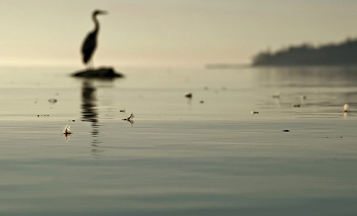

# Seam Carving Image Resizer

## Table of Contents
- [Overview](#overview)
- [Features](#features)
- [Prerequisites](#prerequisites)
- [Installation](#installation)
- [Usage](#usage)
- [How It Works](#how-it-works)
- [Technologies Used](#technologies-used)
- [Sample Images](#sample-images)
- [Contact](#contact)

## Overview
Seam Carving is an intelligent image resizing algorithm that reduces image dimensions while preserving the most important content. Unlike traditional resizing methods that crop or stretch images, this algorithm intelligently removes the least significant pixels (seams) based on their energy or in simple words it removes least important pixels from the image that are not contributing much to the image.

## Features
- Dynamic image resizing without content distortion
- Vertical and horizontal seam removal
- Real-time visualization of seam carving process
- Preserves image's visual integrity
- Supports arbitrary image reduction

## Prerequisites
- OpenCV library
- C++ compiler (g++)
- Linux/Unix system recommended

## Installation

### Dependencies
1. Install OpenCV:
```bash
sudo apt-get update
sudo apt-get install libopencv-dev
```

2. Verify OpenCV installation:
```bash
pkg-config --modversion opencv4
```

### Compile the Project
```bash
g++ seam_carving.cpp -o seam_carving `pkg-config --cflags --libs opencv4`
```

**Note**: Replace seam_carving.cpp name with name of your source code

## Usage
1. Prepare input image
2. Run the program:
```bash
./seam_carving /address/of/image/input_image.jpg
```
3. You will see original image height and width in pixels

4. Enter desired width and height reduction that you want to remove from your image

5. Press Enter to start the seam carving process

6. You will see the original image getting shrinked vertically and horizontally in real time

7. At the end output image will be stored in the same folder as your source code 

8. You will see the final image width and height on the terminal

**Note**: replace input_image.jpg with your image file

## How It Works
The algorithm follows these key steps to reduce the size both vertically and horizontally:
1. Calculate pixel energy matrix using dual-gradient energy function
2. Find lowest-energy seam path using dynamic programming 
3. Remove identified seam by shifting pixels
4. Repeat until desired image size is achieved


### Key Algorithmic Stages
- RGB Extraction
- Energy Gradient Computation
- Dynamic Programming Seam Selection
- Iterative Seam Removal

## Technologies Used
- C++
- OpenCV
- Dynamic Programming Algorithm

## Sample Images
### Terminal Interface

### Original Image


### Vertical Seam Removal


### Horizontal Seam Removal


### Final Reduced Image


## Limitations
- Works best with images having clear color gradients
- Performance may vary with complex images
- Requires manual input for reduction amount

## Future Improvements
- Machine learning-based seam selection
- Support for larger image size 

## Contact
[Ayush rai]
[ayushrai.cse@gmail.com]

---

